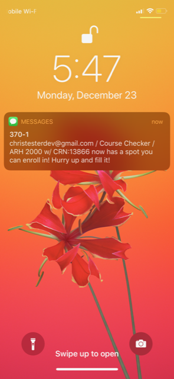

<h1 align="center"> FAU Course-Checker </h1> <br>
<p align="center">
  
</p>

<p align="center">
  This application will constantly check for an opening in a course you're waiting to join then text or email you about it!
</p>

## Setting Up

These instructions will get you a copy of the project up and running on your local machine for development and testing purposes.


### Prerequisites

[Node](https://nodejs.org) has to be installed first before continuing.

### Installing

Run the command below in the [main](/) directory.

```
npm install
```

### Config

The following variables need be changed in the [config](/config/default.json) file for the application to work. See more info on setup [here](https://nodemailer.com/about/).

```json
"fromEmailService": "<FROM_EMAIL_SERVICE>",
"fromEmail": "<FROM_EMAIL>",
"password": "<FROM_EMAIL_PASSWORD>",
"toEmail": "<TO_EMAIL>"
```

For more information on how to set the application to text you when there's an opening, see [here](https://20somethingfinance.com/how-to-send-text-messages-sms-via-email-for-free/).

### Running Locally

Run the command below in the [main](/) directory.

```
node index
```